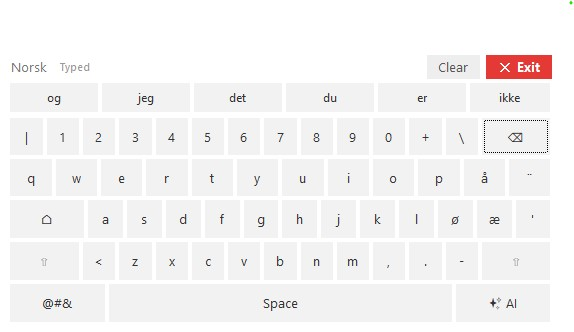

# Virtual Keyboard

A Windows desktop virtual keyboard prototype inspired by Google's compact
on-screen keyboard. Click the keys to type into the active application, or click a
suggested word to finish the word you started.

Built with **Python and Tkinter**, using the Windows **SendInput** API — no third-party packages required.



## Run

```powershell
python app.py
```

You can also double-click `run.bat`.

## Features

- Compact keyboard layout with Norwegian-style keys, including `å`, `ø`, and `æ`
- Clickable letters, numbers, punctuation, space, home, shift, and backspace
- **Focus-safe typing**: the window never steals focus, so it types into apps that
  close on focus loss (Windows Search, Explorer folders, etc.)
- **Symbols toggle** (`@#&` key): swaps the suggestion strip for extra symbols
  (`! ? @ # & % * ( ) = / _ : "`) that aren't already on the keyboard; press again
  to go back
- **Word suggestions** that insert the rest of the word plus a trailing space
- **Clear** button: selects all and clears the focused text field
- **AI** key: placeholder for a future AI assistant
- Custom title bar with a clearly marked red **Exit** button, draggable anywhere
  along the top bar
- **Taskbar icon** via a lightweight helper window, while the keyboard itself stays
  non-activating
- Pure standard library — Tkinter UI and the Windows `SendInput` API

## Settings

Click the **⚙** button in the top bar to open settings:

- **Theme** — Light or Dark (recolors the whole keyboard live)
- **Language** — Norsk or English (switches the word-suggestion dictionary)
- **Always on top** — keep the keyboard floating above other windows, or not

Your choices are saved to `settings.json` next to `app.py` and restored on the next
launch.

## Notes

- This prototype is Windows-only. Click into the app where you want text to go, then
  click keys on the virtual keyboard.
- Switching language changes the word suggestions and the header label; the physical
  key layout still shows the Norwegian `å ø æ` keys.
- Sending input to an app running as administrator requires running the keyboard as
  administrator too.
